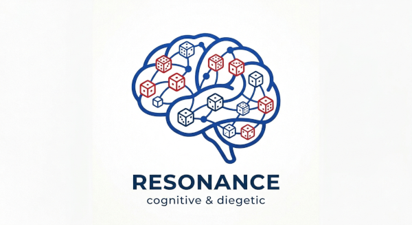

# Résonance : Pour un système cognitif et diégétique dans les JDR

## 1. Le Constat 

Depuis cinquante ans, les systèmes des JdR ont hérité du passé (les wargames), ont tenté de simuler la physique (la gravité, les dommages d'une arme) ou se sont focalisés sur la narration (les arcs dramatiques). Mais ils imposent généralement le même moteur de résolution à un hacker, un chaman ou un chevalier ou alors crée un système réduit à des archétypes (comme dans le PbtA).

Le système apparaît alors comme une surcouche universelle, un meta-jeu qui éloigne le joueur d'une immersion totale. En effet, l'interface ludique (les pourcentages, les modificateurs) crée une barrière étanche entre l'esprit du joueur et celui du personnage.

Je pense comme Ron Edwards que le système compte: "System does matter". 

## 2. Le Changement de Paradigme

**Résonance** postule que la mécanique de résolution doit:
- être la plus naturelle possible
- et refléter les spécificités du monde

Les règles ne doivent pas simplement simuler si une action réussit, elles doivent simuler la manière dont la réalité de cet univers précis réagit à la conscience du personnage. Changer de philosophie intime ou de plan d'existence, c'est changer littéralement de mécanique de jeu.

## 3. Les principes

Le système ne repose plus sur des probabilités froides, mais sur l'alignement de trois éléments fondamentaux :

* **L'intention diégétique:** Le monde est complexe et le joueur doit y trouver un sens. En s'immergeant dans la diégèse, il extrait des éléments tangibles (mots-clés, culture, environnement, émotions) pour pouvoir formuler une approche claire et justifiée dans TOUTE situation. 

* **Le Prisme:** Le monde évalue cette approche à travers sa propre vérité. Les dés ne sont plus des générateurs de probabilités aveugles : ils doivent représenter la réalité telle que vécue par le personnage. Si la règle résonne avec le monde, elle résonnera avec celui qui l'explore. En supprimant l'interface mathématique (les bonus, les scores), le système détruit le méta-jeu. Le joueur ne fouille plus sa feuille de personnage, il fouille la réalité de la scène. La mécanique force alors le joueur à penser, douter et espérer exactement comme son personnage.

# Comment rendre la mécanique de résolution naturelle?

## Les Mises et l'Approche Cognitive

### La fin de l'illusion mathématique et du méta-jeu

Dans la vraie vie, aucun être humain n'aborde un problème en estimant qu'il a "75 % de chances de réussir". Face à un obstacle, un individu évalue instinctivement ses forces, ses faiblesses, son environnement et son état émotionnel. Cette évaluation n'est pas un chiffre froid, c'est un espoir ou une crainte.

**Resonance** supprime intégralement ces statistiques abstraites. Il propose un système purement diégétique (ancré dans la narration) où la mécanique n'est plus une surcouche qui sort le joueur de l'immersion, mais un prolongement direct de sa propre conscience.

### Un nouveau simulationnisme : Le raisonnement naturel

Historiquement, le simulationnisme s'est focalisé sur la physique du combat (calculer la pénétration d'une armure ou la trajectoire d'une flèche). Ici, nous proposons un **simulationnisme cognitif et universel**. Il ne s'applique pas qu'au combat, mais à n'importe quel domaine (une négociation politique, une escalade périlleuse, la création d'une œuvre d'art), sous réserve que la table prenne la peine d'étudier la scène à la loupe.

Au lieu de s'appuyer sur des mécaniques artificielles, le système reproduit le fonctionnement de l'esprit humain. Un individu évalue le poids des éléments qui l'entourent pour comprendre un contexte et agir en conséquence. Dans ce système, le PJ et le MJ font exactement la même chose. Face à une situation, chaque camp rassemble des **Mises** : des arguments narratifs justifiés par la fiction. Il peut s'agir d'une arme héritée de ses ancêtres, d'une bourrasque de vent providentielle, d'une haine viscérale, ou d'une discipline de fer. Il n'y a plus de tables, de mathématiques, de statistiques : MJ et PJ observent et exploitent la réalité de la scène, du monde et du récit qu'ils explorent. 

### La Mécanique : Focus, Facteurs Cadres et Mises

Lorsqu'un conflit éclate, ou que le récit arrive à la possibilité d'une bifurcation narrative, la résolution passe alors par l'analyse minutieuse de la situation.

* **L'établissement des Camps :** Les Mises du Camp A sont constituées de tout ce qui favorise son objectif, plus les éléments qui viennent contrecarrer le Camp B (et inversement pour le Camp B).
* **Le Focus :** On ne jette pas tous les traits de sa fiche de personnage sur la table. La table définit ce qui est *réellement* important à cet instant précis. Dans un pur débat philosophique, la maîtrise de l'épée longue d'un PJ n'entre pas dans le Focus et ne donne aucune Mise.
* **Les Facteurs Cadres :** L'environnement peut imposer un élément tellement écrasant qu'il dicte ce qu'il est ontologiquement impossible de tenter. Exemple : Si une scène se déroule dans un sanctuaire divin dédié à la paix absolue, toute tentative d'agression ou d'intimidation est métaphysiquement étouffée. Le Facteur Cadre force les Mises à s'aligner sur d'autres approches (comme l'éloquence ou la prière).

### L'auto-équilibrage pour le MJ : Le jeu "à somme nulle"

L'une des craintes face à un système narratif est de voir les joueurs justifier tout et n'importe quoi pour "grappiller" des dés. C'est ici qu'intervient la règle d'or du système : le MJ n'est pas l'adversaire des joueurs, il est le gardien de la cohérence de l'univers.

L'affrontement repose sur un équilibrage diégétique naturel, un **jeu à somme nulle**. Si un joueur argumente que son casque terrifiant doit lui accorder une Mise supplémentaire, le MJ a le droit de l'accepter. Mais en validant ce détail, le joueur vient d'augmenter le niveau de "zoom" de la scène. Le MJ (qui gère l'opposition) est alors tout à fait légitime pour trouver, dans ce nouveau niveau de détail, une Mise en retour pour le PNJ adverse (par exemple, la vision perturbante des cicatrices du PNJ qui déstabilise le PJ en retour).

Cette mécanique éduque organiquement les joueurs : chercher des avantages avec des arguments futiles ne fera que donner des munitions narratives supplémentaires au MJ. L'histoire en sort toujours gagnante.

### La Cristallisation : Le Tirage

Jusque là, chaque joueur est dans son personnage (PJ, PNJ, obstacle, ...) avec une approche naturelle, presque littéraire, littérale.

Voyons maintenant comment Resonance propose d'aller plus loin. 

En effet, une fois le nombre de Mises défini pour chaque camp, le système bascule dans une logique d'observation et de résolution.

Avant le tirage, l'issue de la scène est un nuage d'incertitudes. La victoire, la défaite, l'exploit ou la catastrophe existent simultanément sous forme de potentiels. Le nombre de Mises rassemblées par le joueur ne garantit pas la réussite ; il ne fait que sculpter et étirer ces potentiels en sa faveur.

Puis, les dés roulent. C'est le moment de l'observation. À cet instant précis, le lien mental entre le détail narratif (la Mise) et le dé qu'il a apporté disparaît. L'incertitude se cristallise pour ne laisser qu'une seule réalité mathématique : le nombre final de réussites. Le chaos du hasard se fige pour dicter la nouvelle vérité de la fiction, qui sera ensuite interprétée par la table.

Et ca sera la différence de réussites entre les deux camps qui indique l'ampleur du succès ou de l'échec.

C'est la que le Game Designer d'un jeu Resonance intervient: la façon dont on détermine le nombre de réussites pour un tirage donné dépend du jeu qu'on veut créer. 

**comment l'univers détermine-t-il le nombre de réussites à partir de ces dés ?**

Dans un monde strictement physique et dénué de magie (le référentiel "agnostique"), la règle par défaut est d'une simplicité binaire : **un résultat pair (2, 4, 6) génère 1 réussite, un résultat impair (1, 3, 5) est un échec**. C'est la réalité fondamentale, matérielle et indifférente.

Mais le véritable défi du *game designer* commence ici : il s'agit d'altérer cette règle de lecture pour qu'elle devienne le miroir parfait de la réalité (ou de la philosophie) dans laquelle il veut immerger ses joueurs. La façon de lire les dés doit *résonner* avec le monde exploré dans le jeu par les joueurs. 

### Proof of Concept : Les Cadres de Pensée dans Glorantha Perspectives

Pour illustrer ce concept, le jeu [Glorantha Perspectives](https://aleascript.github.io/glorantha-perspectives/content/fr/srd/glorantha-perspectives-fr.pdf) propose une démonstration magistrale. Dans ce monde, la magie n'est pas une liste de sorts, c'est un prisme à travers lequel on appréhende l'univers. La mécanique mute donc selon la philosophie de celui qui lance les dés :

* **L'Amplification (Le Théisme) :** L'initié s'en remet aux Dieux. Les pairs sont des réussites, mais les "6" explosent et permettent de relancer les dés impairs. La mécanique simule littéralement le miracle : la foi transforme l'échec en victoire.
* **Les Harmoniques (L'Animisme) :** Le chaman vit entouré d'esprits erratiques. Les pairs réussissent, mais le joueur doit chercher des paires parmi ses échecs (par exemple, deux "3" ou deux "5"). Ces "doubles impairs" entrent en résonance pour former 1 réussite, simulant le pacte noué à la volée avec un esprit local.
* **La Compression (La Logique) :** Le savant rejette la magie de l'instant. Il n'y a plus de pairs ou d'impairs : le joueur additionne la valeur de *tous* ses dés, puis divise la somme totale par 5. C'est froid, mesurable, et dépourvu de tout miracle.
* **L'Interférence (Le Mysticisme) :** Le mystique sait que le monde est une illusion. S'il obtient des "1", ceux-ci annihilent purement et simplement les "6" du camp adverse. La mécanique démontre la futilité de la force brute matérielle.

### L'horizon du Game Designer : Concevoir ses propres prismes

Le *game design* diégétique ouvre des portes infinies. Le créateur n'est plus limité à changer des valeurs de difficulté ; il peut manipuler la matière même du hasard pour faire ressentir son univers.

Voici comment Resonance peut être étendu et hacké :

**1. Changer la forme des dés pour simuler une autre conscience**
Pourquoi se limiter à des D6 ? Dans *Glorantha Perspectives*, la métaphysique insondable des Dragonewts est simulée en utilisant des **D8**, car leur réalité est liée aux 8 Runes de Pouvoir. Les motifs qui apparaissent lors du tirage forcent le joueur à un dilemme déchirant : utiliser la magie pour écraser l'adversaire mais régresser spirituellement (le Wyrm), ou sacrifier sa victoire matérielle pour s'élever vers l'illumination (l'Utuma). Le type de dé dicte l'expérience cognitive.

**2. Donner une sémantique aux couleurs**
Les Mises peuvent avoir des origines différentes, justifiant l'utilisation de dés de couleurs variées.

* *Exemple pour un univers de Space Opera :* Les Mises issues de l'entraînement (dés blancs) obéissent à la règle standard, tandis que les Mises issues de la colère (dés rouges) explosent sur des 6, mais provoquent des dommages collatéraux sur des 1, simulant l'attraction inéluctable du "Côté Obscur".

**3. Des règles dictées par l'environnement (La mutation ontologique)**
Le prisme de résolution peut dépendre de la philosophie du personnage, mais aussi du *plan d'existence* dans lequel il évolue.

* *Exemple Cyberpunk :* Dans le monde physique, les règles sont classiques. Mais lorsqu'un hacker se connecte à la Matrice, la réalité devient du code. La règle de résolution change instantanément pour tout le groupe : on ne cherche plus des valeurs paires, mais des "suites" (1-2-3, 4-5-6) pour simuler l'alignement d'algorithmes et le cassage de pare-feu.
* *Exemple d'Horreur Cosmique :* Faire appel à l'entropie absolue (le Chaos) permet de s'affranchir totalement du lancer de dés pour obtenir une réussite écrasante automatique. Le prix mécanique ? Le joueur doit rayer définitivement un trait ou un être cher de sa fiche, simulant la corruption de son âme.

## Conclusion: une immersion augmengtée, des joueurs impliqués

**Resonance** replace le créateur de jeu dans son véritable rôle : celui d'un architecte de réalités. En modelant la façon dont les dés réagissent aux Mises narratives, le *game designer* ne se contente plus de fournir un arbitre neutre à sa table ; il offre aux joueurs la possibilité de toucher, de manipuler et de ressentir physiquement les lois métaphysiques de l'univers.

Mais la véritable proposition de ce *game design*, c'est la résonance finale : celle qui s'opère dans l'esprit de la table. En forçant le joueur à utiliser la diégèse comme seule munition mécanique, le jeu cesse d'être un exercice de comptabilité pour redevenir ce qu'il aurait toujours dû être. Une ligne directe, sans interférence et sans méta-jeu, entre l'âme du joueur et le monde qu'il arpente.

### Une évidence pour les débutants, un défi pour les vétérans

Longtemps, le jeu de rôle a renvoyé au grand public l'image d'un loisir réservé à des initiés jonglant avec des calculs abscons, masquant ainsi la véritable richesse créative et narrative de ce médium. Et quel joueur n'a pas été sorti de l'immersion par une procédure de jeu complexe, ou nécessitant de chercher dans le manuel la référence exacte ?

**Resonance** a été conçu pour briser cette barrière. Je pense même que ce sont les joueurs débutants qui se sentiront le plus à l'aise et désinhibés face à ce système. La raison en est simple : la création des Mises reproduit avec exactitude le fonctionnement cognitif naturel de n'importe quel être humain. Dans la vraie vie, personne ne calcule un pourcentage ; tout le monde évalue instinctivement ses forces, ses faiblesses ou son environnement. Un néophyte décrira spontanément en quoi la pluie battante ou son courage l'aident à surmonter l'obstacle.

À l'inverse, ce sont les vétérans du jeu de rôle qui peuvent se retrouver momentanément déroutés : pour maîtriser ce système, ils doivent désapprendre des décennies de réflexes mécaniques, abandonner la recherche d'un bonus chiffré sur leur feuille, et réapprendre, tout simplement, à regarder le monde.

### Quelques précisions

#### Le Zoom de Résolution : Action, Séquence ou Script

Une opposition peut couvrir une action isolée (un assaut, une plaidoirie) comme toute une série d’actions étalées dans le temps (un plan). On parle de zoom de résolution, et le choix de ce zoom est souvent implicite. En cas d’ambiguïté, c’est le protagoniste impliqué qui choisit le niveau.

- L’Action : C’est l’opposition par défaut, une action locale et unique.
- La Séquence : Une série d’actions résolue en un seul tirage pour couvrir toute une scène (un raid, une cérémonie, une traversée).
- Le Script : Une suite d’actions ou de scènes connus à l’avance menant à un résultat (une quête héroïque, une succession d’épreuves).

Jouer une séquence : On joue l’opposition en un seul tirage pour connaitre le résultat global. On peut appliquer une séquence pour résoudre un simple vol dans une maison, une négociation ou un combat mais aussi une immense bataille qui met en scène plusieurs armées.

Résoudre un script : On décompose l’obstacle en étapes (des actions pour une séquence, des scènes pour un script) et chaque étape représente une ou plusieurs étapes clés à franchir. On rassemble ensuite les mises de chaque camp et l’on procède au tirage normal. En cas d’échec, on compte le nombre de réussites obtenues par le camp protagoniste pour localiser l’étape qui a échoué (une réussite = une étape franchie). En cas de succès, on est nécessairement allé au bout. La suite peut ensuite être narrée collectivement.

#### Les Obstacles à Clés : Résoudre un Problème

Certains obstacles sont de véritables problèmes à résoudre : une énigme, une enquête, une fabrication complexe, quelque chose à réparer. Côté obstacle, on définit alors un certain nombre de clés qu’il faudra découvrir ou franchir pour réussir. Exemples : une enquête (le coupable, le mobile, le mode opératoire) ou une potion à fabriquer (le laboratoire, les ingrédients, la recette).

L’opposition se fait alors face au nombre de clés à découvrir.

#### Résolution, Interprétation et Rétributions

Graduation du Résultat:

- Différence de 2 réussites ou plus : L’action se solde par un Exploit (ou un Fiasco).
- Différence de 1 réussite : L’action se solde par une Victoire/Succès (ou une Défaite/Échec).
- Égalité : L’action aboutit à un Status-quo (ou Revers). S’il est impossible de rester sur un status quo narratif, chaque camp rajoute une mise supplémentaire symbolisant la surenchère, et l’on procède à un nouveau tirage.

Les Rétributions et l’Évolution :

Le système évite au maximum le méta-jeu : il n’y a pas de bonus ou de malus mécaniques de fin de partie. Les personnages évoluent de manière purement diégétique. C’est bel et bien la narration qui sert de moteur exclusif à l’évolution.

Comment évolue-t-on ? L’évolution passe par la dynamique des mots-clés du personnage : l’ajout de nouveaux mots-clés, la suppression de traits obsolètes, ou la modification d’éléments existants. À cela s’ajoutent les rétributions accordées par le MJ, telles que de nouveaux liens, des attaches, des cadeaux, un nouveau pouvoir ou une prise de conscience.

Quand évolue-t-on ? Cette évolution ne survient pas à la fin d’un scénario. Elle intervient de manière organique lors d’un Fiasco ou d’un Exploit (qui se traduisent par une différence de 2 réussites ou plus lors d’un tirage), ou tout simplement quand l’histoire l’exige.

#### Les Tirages sans Opposition : Mesurer l’Ampleur

Puisque le système est intégralement narratif, il arrive que le but d’un tirage ne soit pas d’obtenir une victoire face à une adversité directe. Parfois, l’enjeu est simplement d’évaluer l’envergure d’une action pour en mesurer le niveau de réussite ou le niveau d’échec.

- Mesurer l’échec : Ce cas est idéal dans un "scénario toboggan" (une structure fréquente dans les aventures old school) où l’échec final est de toute façon inéluctable. Le tirage détermine alors la gravité de la chute et ses conséquences.

- Mesurer la réussite : Parfait lorsqu’il s’agit de quantifier la puissance d’une préparation minutieuse, comme l’exécution d’un rituel complexe pour pénétrer dans le plan des héros.

La Résolution :

Dans ces cas précis, le camp actif rassemble ses mises et effectue un tirage standard, mais sans aucune opposition adverse. Il suffit alors de connaître le nombre total de réussites obtenues et de l’interpréter selon la situation dramatique en cours.

N’obtenir aucune réussite lors de ce type de tirage doit être interprété comme un réel problème pour les joueurs, plongeant immédiatement le récit dans la crise.

#### Gérer la léthalité

Cela peut être défini dans le contrat social du jeu. Mais dans tous les cas, pour préserver l’immersion tout en évitant la frustration d’une "mort stupide" sur un mauvais tirage, le MJ doit toujours prévenir le joueur en cas de risque létal.

Voici des degrés d’avertissement narratifs que le MJ peut employer :

"Ceci pourrait vous coûter cher" : risque de blessure grave, perte d’un objet précieux ou d’un allié.

"Un échec pourrait être fatal" : mort possible et définitive du personnage.

"La contamination vous guette" : risque de transformation irréversible ou de souillure permanente.

Face à cet avertissement, le joueur a le droit d’opter pour un recul stratégique. Il peut modifier son objectif diégétique et on regarde les mises applicables pour ce nouvel objectif. 
