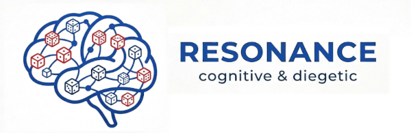

# Résonance : Moteur de Résolution Cognitive pour Jeux de Rôle

## Qu'est-ce que Résonance ?

**Résonance n'est pas un jeu de rôle.** C'est une **architecture de résolution cognitive**, un moteur générique conçu pour être adapté à n'importe quel univers.

Pour le dire autrement : si le **D20 System** standardise la *probabilité* (le seuil de réussite), si le **PbtA** standardise la *structure narrative* (les Moves et les coups durs), et si le **BRP** standardise la *compétence* (le pourcentage), alors **Résonance standardise la pertinence**.

Il répond à cette question fondamentale :

> *"De tout ce qui constitue ton personnage et cette scène, qu'est-ce qui pèse vraiment dans la balance, maintenant ?"*

---

## Ce que Résonance standardise : l'immersion par la pertinence

Le moteur repose sur une idée simple : **la règle ne doit pas être une interface entre le joueur et le monde. Elle doit être un prolongement de son regard.**

Dans la vraie vie, personne n'aborde un problème en se disant qu'il a "75% de chances de réussir". Face à un obstacle, on évalue instinctivement ses forces, ses faiblesses, son environnement, son état émotionnel. Cette évaluation n'est pas un chiffre froid, c'est un **espoir** ou une **crainte**.

**Résonance** capture ce processus naturel :

- Le joueur observe la scène (la diégèse).
- Il identifie ce qui, dans cette situation, joue en sa faveur.
- Il confronte ces éléments à ceux de l'adversaire ou de l'obstacle.
- Un tirage cristallise l'incertitude.
- La table interprète le résultat.

**Aucun calcul. Aucune recherche de bonus. Juste une attention portée au monde et à ce qui le rend vrai. Des joueurs totalement  impliqués.**

## Pourquoi choisir Résonance ? Le "Kick" du Game Designer

En tant que créateur de jeu, vous vous êtes sans doute heurté à ces frustrations :

- **Des combats interminables** où les joueurs et le MJ comptent des points de vie pendant 45 minutes, pendant que la tension narrative s'évapore.
- **Des recherches de règles** sur un point de détail qui coupent net l'élan dramatique.
- **Des joueurs qui jouent leur feuille de personnage** plutôt que la scène, cherchant le bonus optimal plutôt que l'action cohérente.
- **Des amis rebutés** par l'aspect technique du JdR, qui se sentent exclus alors qu'ils auraient tant à apporter à la table.

**Résonance répond à ces problèmes à la racine.**

### Ce qu'il résout :

| Problème | Solution Résonance |
|----------|-------------------|
| **Méta-jeu et calculs** | Plus de pourcentages, plus de modificateurs. Le joueur observe la scène, pas sa feuille. |
| **Combats longs** | Un tirage ou quelques jets tranchent l'issue. On interprète le résultat, on passe à la suite. |
| **Recherche de règles** | La règle est dans la fiction. Si c'est cohérent, c'est une Mise. Sinon, ce n'en est pas une. La règle c'est votre bon sens et votre culture. Pas besoin de règle spécifique sur le vol spatial, les batailles rangées, les jeux d'alcool, les longues négociations, etc... Elles sont deja incluses dans le système selon le zoom de précision que vous voulez. |
| **Exclusion des joueurs "non-geeks"** | Le système récompense l'attention, l'imagination et la sensibilité, pas la mémoire des tables. |
| **Décalage entre lore et mécanique** | Le Prisme fait du lore une règle. La philosophie du monde devient la façon de lire les dés. |

### Pourquoi vous, game designer, devriez l'adopter?

**1. Parce que votre univers repose sur des croyances antagonistes.**
Que vos personnages soient des dieux en conflit, des schizophrènes dans un monde fragmenté, ou des êtres traversant des plans d'existence contradictoires (*Sandman*, *L'Incal*), Résonance est le seul moteur où la philosophie du personnage **change littéralement la mécanique**. Un dieu de la guerre ne résout pas un conflit comme un dieu des rêves. Le Prisme incarne cette différence.

**2. Parce que vous voulez que le système soit le miroir du lore.**
Plus de décalage entre "ce que dit le texte" et "ce que fait le joueur". Dans Résonance, le lore n'est pas un décor plaqué sur des règles génériques. Il est la règle. Les mythes, les runes, les interdits, les esprits : tout ce qui compose votre univers devient une Mise ou un Prisme. Le joueur ne lit pas le lore pour s'imprégner ; il le **joue** à chaque tirage.

**3. Parce que vous voulez éliminer le "gaming the system".**
Fini le meta-jeu de la recherche de bonus, l'optimisation de personnage, les combos de talents. Dans Résonance, il n'y a pas de "bonne" construction de personnage. Il n'y a que des choix narratifs cohérents. Un joueur ne peut pas "casser" le système ; il ne peut que **trahir son personnage** en proposant une Mise qui n'a pas de sens dans la fiction. Le système éduque organiquement les joueurs à s'ancrer dans la fiction pure.

**4. Vous n'êtes plus un équilibreur de chiffres.**
Vous êtes un architecte de réalités. Votre travail consiste à créer du lore, des prismes et des facteurs cadres. Le reste, le moteur le gère.

**5. Votre univers sera joué, pas seulement lu.**
Les joueurs ressentiront physiquement, à travers les dés, ce qui rend votre monde unique. Un joueur ne *croit* pas en la magie de votre univers ; il la *pratique* à chaque tirage.

**6. Vous touchez un public plus large.**
Les joueurs débutants, les amateurs d'improvisation, les personnes rebutées par l'aspect technique trouveront dans Résonance un système qui les inclut sans les contraindre.

---

## Résonance face aux autres moteurs : une grille d'analyse

Pour comprendre pleinement l'apport de Résonance, comparons-le aux moteurs qui ont marqué l'histoire du JdR. Ce tableau montre ce que chaque système *standardise* — c'est-à-dire ce qu'il met au coeur de son fonctionnement, sa raison d'être mécanique.

| Moteur | Standardise | Ce qu'il simule | Ce qu'il ne fait pas |
|--------|-------------|-----------------|----------------------|
| **D20 System** (D&D) | **La progression par niveau et la puissance** | L'escalade héroïque. Les PV augmentent, les sorts deviennent dévastateurs, les ennemis s'adaptent au niveau du groupe. | Il ne simule pas le danger réel. Un paysan restera toujours un paysan. La puissance est absolue, pas contextuelle. |
| **BRP** (RuneQuest, Call of Cthulhu) | **La simulation du "réel"** | La physique du monde : la gravité, la pénétration d'une armure, les compétences qui s'améliorent par l'usage. Le monde est dangereux, la mort est probable. | Il ne simule pas la perception subjective. Un humain reste un humain, qu'il soit chaman ou chevalier. Le système est le même pour tous. |
| **PbtA** (Apocalypse World) | **Les tropes et les genres narratifs** | Les codes du cinéma, de la série, du roman. Chaque Move est un cliché du genre. Le jeu est taillé pour un style précis et ne s'en écarte pas. | Il ne simule pas un monde ouvert. Il est un **cadre**, parfois une prison dorée : le jeu fonctionne tant qu'on reste dans le genre prévu. |
| **FATE** | **La négociation et le compromis narratif** | La dynamique de table : les joueurs et le MJ marchandent sur ce qui est important via les Aspects et les Points de Destin. Le système récompense les prises de risque et les complications. | Il ne simule ni un monde physique ni un genre précis. Il standardise **la conversation**, pas l'univers. Le lore est un décor, pas une mécanique. |
| **RÉSONANCE** | **La pertinence** (ce qui pèse dans la balance, ici et maintenant) | La cognition d'un personnage face à un monde qui lui répond selon ce qu'il est. Le système ne dit pas "tu es fort", il dit "ce que tu es compte dans cette situation précise". | Il ne standardise pas de progression, ni de genre, ni de physique. Il est un **miroir** : le monde dicte les règles, pas le système. |

### Ce que ce tableau révèle sur Résonance :

- **D20** dit : "Plus tu avances, plus tu es puissant."
- **BRP** dit : "Le monde est dangereux ; sois compétent."
- **PbtA** dit : "Joue selon les codes du genre."
- **FATE** dit : "Négocie avec le MJ pour que l'histoire soit intéressante."
- **Résonance** dit : "Regarde le monde, comprends qui tu es, et le reste suivra."

> *Résonance ne standardise ni une courbe de progression, ni une physique, ni un genre, ni une négociation. Il standardise **l'immersion** : la capacité du joueur à être pleinement dans la scène, sans interface.*

---

## Le coeur du moteur : les trois piliers de Résonance

Pour qu'un jeu fonctionne avec Résonance, le game designer doit définir trois piliers. Ce sont eux qui donnent sa couleur à l'univers.

### 1. L'Intention diégétique (les Mises)

Le monde est complexe. Le joueur doit y trouver du sens. Pour agir, il extrait de la scène des éléments tangibles :

- Des mots-clés (son passé, sa culture, ses blessures).
- Des éléments d'environnement (la pluie, une falaise, une foule).
- Des émotions (la peur, la colère, l'amour).
- Des relations (un allié, un ennemi, une dette).

Chaque élément ainsi identifié devient une **Mise** : un argument narratif qui pèse dans la balance.

> **Important :** La Mise n'est pas un bonus. C'est un fragment de vérité diégétique. Elle dit : "Mon personnage EST ceci, il a VÉCU cela, il porte CET objet." Le système ne valide que ce que la fiction justifie.

### 2. Le Prisme (la règle de lecture)

Une fois les Mises posées, on lance les dés. Mais **la manière de lire ces dés dépend du monde**.

Dans un univers "agnostique" (physique, sans magie), la règle est binaire :

- **Pair (2, 4, 6)** = 1 réussite.
- **Impair (1, 3, 5)** = échec.

C'est la réalité fondamentale, matérielle et indifférente.

Mais le game designer peut altérer cette règle pour qu'elle devienne le miroir de la philosophie de son univers. C'est ce qu'on appelle le **Prisme**.

**Exemples de prismes :**

- **Le Théisme** : les pairs réussissent, mais les *6 explosent* et relancent les impairs. La foi transforme l'échec en miracle.
- **L'Animisme** : les pairs réussissent, mais les *doubles impairs* (deux 3, deux 5) entrent en résonance et forment une réussite. On pactise avec l'errance des esprits.
- **La Logique** : on additionne tous les dés, on divise par 5. Rien n'est laissé au hasard. Tout se calcule.
- **Le Mysticisme** : les *1 annihilent les 6* adverses. La victoire matérielle est une illusion.

**Le Prisme est le cœur philosophique du jeu.** Il incarne la réponse du monde à la question : "Qui es-tu ?"

### 3. Le Facteur Cadre (ce qui est ontologiquement impossible)

Certaines situations imposent des limites si puissantes qu'elles ne peuvent être contournées. Ce sont les **Facteurs Cadres** :

- Un sanctuaire dédié à la paix absolue : toute agression est métaphysiquement étouffée.
- Un champ de gravité extrême : nul ne peut s'envoler.
- La présence du Chaos : les règles ordinaires sont suspendues.

Le Facteur Cadre ne donne pas de Mises. Il **interdit** certaines approches ou **force** les Mises à s'aligner sur d'autres logiques.

---

## La mécanique de résolution (étape par étape)

### 1. Déterminer les camps et les Mises

Chaque camp (PJ, PNJ, obstacle) rassemble ses Mises :

- Les éléments qui favorisent son objectif.
- Les éléments qui contrecarrent l'objectif adverse.

**Exemple :** Un Orlanthi charge un légionnaire lunaire.

- **Orlanthi** : Vent providentiel (+1), Épée héritée (+1), Lame de Foudre (+1).
- **Lunaire** : Discipline de phalange (+1), Grand bouclier (+1), Bénédiction de la Lune Rouge (+1).

**3 Mises contre 3 Mises.**

### 2. Le Focus

On ne jette pas tous les traits de la fiche sur la table. La table définit ce qui est *réellement* important à cet instant précis.

Dans un débat politique, la maîtrise de l'épée longue ne donne aucune Mise. Dans une escalade, le talent d'orfèvre est inutile.

Le Focus est un **accord tacite** sur la nature de la scène.

### 3. Le tirage (la cristallisation)

Chaque camp lance un nombre de dés égal à ses Mises.

Le lien mental entre chaque Mise et le dé qu'elle a apporté disparaît. L'incertitude se cristallise en un seul nombre : **le total de réussites** (selon le Prisme du camp).

### 4. L'interprétation

On compare les totaux :

| Écart | Résultat |
|-------|----------|
| **+2 ou plus** | Exploit (ou Fiasco pour le perdant) |
| **+1** | Victoire (ou Défaite) |
| **0** | Status Quo (surenchère possible) |

La table interprète le résultat narrativement. L'ampleur du succès ou de l'échec est dictée par l'écart.

---

## L'auto-équilibrage : le jeu à somme nulle

L'une des craintes face à un système narratif est de voir les joueurs justifier tout et n'importe quoi pour accumuler des Mises.

**Résonance** résout ce problème par un équilibrage diégétique naturel.

Si un joueur argumente que son casque terrifiant lui accorde une Mise, le MJ peut l'accepter. Mais en validant ce détail, le joueur augmente le "zoom" de la scène. Le MJ est alors légitime pour trouver, dans ce nouveau niveau de détail, une Mise en retour :

> *"Le Broo est intrigué par ton casque (+1 pour toi), mais tu es perturbé par les organes purulents qui sortent de son ventre (+1 pour lui)."*

**C'est un jeu à somme nulle.** Chaque avantage trouvé par un camp peut devenir un avantage pour l'autre. Les joueurs apprennent vite : chercher des avantages futiles ne fait que donner des munitions narratives au MJ.

---

## Les Outils du Game Designer

### Créer son propre Prisme

Pour adapter Résonance à un nouvel univers, le game designer doit répondre à trois questions :

1. **Quelle est la philosophie du monde ?** (Ce que les personnages croient, ce qui structure leur réalité.)
2. **Comment cette philosophie affecte-t-elle le hasard ?** (Quelle règle de lecture des dés ?)
3. **Quel est le prix à payer pour transgresser cette philosophie ?** (Le Chaos, la folie, la corruption, le sacrilège.)

**Exemple d'un prisme "Horreur Cosmique" :**

- **Règle normale** : pairs = réussite.
- **Appel à l'entropie** : le joueur peut ignorer son tirage et obtenir un Exploit automatique.
- **Le prix** : il doit rayer définitivement un trait, un lien ou un être cher de sa fiche.

### Changer la forme des dés

Pourquoi se limiter aux D6 ?

- **D8** (pour une cosmogonie à 8 runes) : les motifs de dés identiques ou les extrêmes (1 et 8) créent des dilemmes.
- **D10** (univers cyberpunk) : les suites (1-2-3, 4-5-6) deviennent des réussites pour simuler le code.
- **D12** (mythologie) : chaque face correspond à un dieu ; le résultat est une intercession.

Le type de dé dicte l'expérience cognitive.

### Donner une sémantique aux couleurs

Les Mises peuvent avoir des origines différentes :

- **Dés blancs** (entraînement) : règle standard.
- **Dés rouges** (colère) : explosent sur 6, mais provoquent des dégâts collatéraux sur 1.

### Utiliser d'autres supports que les dés

Les Mises sont des arguments narratifs. Elles peuvent être matérialisées par :

- **Des cartes** (chaque Mise est une carte posée sur la table).
- **Des perles ou des jetons** (on les accumule avant le tirage).
- **Des objets** (un dé pour chaque élément physique du décor).

L'important est que la Mise soit *tangible* : elle existe dans la fiction avant d'exister dans la mécanique.

---

## Proof of Concept : Glorantha Perspectives

Pour une démonstration complète et opérationnelle du moteur, le jeu **[Glorantha Perspectives](https://aleascript.github.io/glorantha-perspectives/content/fr/srd/glorantha-perspectives-fr.pdf)** est l'illustration parfaite de ce que Résonance peut produire.

Dans cet univers, la magie n'est pas une liste de sorts, c'est un prisme à travers lequel on appréhende le monde. La mécanique mute donc selon la philosophie de celui qui lance les dés :

- **Le Théisme** : L'initié s'en remet aux Dieux. Les pairs sont des réussites, mais les "6" explosent et permettent de relancer les dés impairs. La foi transforme l'échec en victoire.
- **L'Animisme** : Le chaman vit entouré d'esprits erratiques. Les pairs réussissent, mais le joueur doit chercher des paires parmi ses échecs (ex: deux "3" ou deux "5"). Ces "doubles impairs" forment 1 réussite, simulant un pacte noué à la volée.
- **La Logique** : Le savant rejette la magie de l'instant. Il additionne la valeur de *tous* ses dés, puis divise la somme par 5. C'est froid, mesurable, sans miracle.
- **Le Mysticisme** : Le mystique sait que le monde est une illusion. Ses "1" annihilent purement et simplement les "6" du camp adverse.
- **La Pensée Draconique** (avec des D8) : les motifs (dés identiques, 1 et 8) forcent le joueur à choisir entre la puissance matérielle (Wyrm) et l'élévation spirituelle (Utuma).

*Glorantha Perspectives* est à Résonance ce qu'*Apocalypse World* est au PbtA : **la preuve qu'en changeant les prismes, on change l'expérience vécue du joueur, sans toucher au reste du moteur.**

---

## Le Rôle du Game Designer : Architecte de Réalités

Avec Résonance, le *game designer* n'est plus un simple équilibreur de chiffres. Il est un **architecte de réalités**.

Son travail consiste à :

1. **Créer du lore** : des mythes, des cultures, des philosophies qui donnent du sens au monde.
2. **Définir les Mises possibles** : qu'est-ce qui, dans cet univers, peut être invoqué comme un atout ? (Les runes, les esprits, les dettes de sang, les artefacts.)
3. **Concevoir les Prismes** : quelle règle de lecture des dés incarne la philosophie du monde ?
4. **Écrire les Facteurs Cadres** : qu'est-ce qui est ontologiquement impossible ou sacrilège ?

**Le système ne fait pas le jeu. C'est le lore qui fait le jeu.** Résonance n'est que le miroir qui le reflète.

---

## Pourquoi Résonance est accessible aux débutants (et déroutant pour les vétérans)

**Les débutants** sont naturellement à l'aise avec Résonance. La création des Mises reproduit exactement le fonctionnement cognitif de n'importe quel être humain. Un néophyte décrira spontanément en quoi la pluie battante ou son courage l'aident à surmonter un obstacle.

**Les vétérans**, en revanche, doivent désapprendre des décennies de réflexes mécaniques :

- Abandonner la recherche d'un bonus chiffré.
- Cesser de fouiller leur feuille de personnage.
- Réapprendre, tout simplement, à regarder le monde.

**Résonance est un retour à l'essentiel : le jeu comme le pratiquaient les enfants dans la cour de récréation.**

> *Deux enfants jouent aux cow-boys. L'un dit : "J'ai mon pistolet et je suis caché derrière le rocher." L'autre répond : "J'ai mon bouclier en fer et mon frère arrive en renfort." Ils n'ont pas besoin de règles. Ils ont besoin d'un accord sur ce qui est juste. Résonance est le gardien de cet accord.*

---

# Règles Complémentaires (Précisions techniques)

Cette section détaille les ajustements pratiques pour adapter le moteur à différentes situations de jeu.

## Le zoom de résolution : Action, Séquence ou Script

Une opposition peut couvrir une action isolée comme toute une série d'actions étalées dans le temps. Le choix du zoom est implicite ; en cas d'ambiguïté, c'est le protagoniste impliqué qui choisit.

- **L'Action** : L'opposition par défaut, une action locale et unique (un assaut, une plaidoirie).
- **La Séquence** : Une série d'actions résolue en un seul tirage pour couvrir toute une scène (un raid, une cérémonie, une traversée). On joue l'opposition en un seul tirage pour connaître le résultat global.
- **Le Script** : Une suite d'actions ou de scènes connues à l'avance menant à un résultat (une quête héroïque, une succession d'épreuves). On décompose l'obstacle en étapes. En cas d'échec, le nombre de réussites du camp protagoniste indique l'étape qui a échoué (1 réussite = 1 étape franchie). En cas de succès, on est allé au bout.

## Les obstacles à clés : résoudre un problème

Certains obstacles sont de véritables problèmes à résoudre (enquête, énigme, fabrication complexe). Côté obstacle, on définit un certain nombre de **clés** à découvrir ou franchir pour réussir.

*Exemples :* Une enquête (le coupable, le mobile, le mode opératoire) ou une potion (le laboratoire, les ingrédients, la recette).

L'opposition se fait alors face au nombre de clés à découvrir.

## Résolution, interprétation et rétributions

**Graduation du Résultat :**

- **Différence de 2+** : Exploit (ou Fiasco).
- **Différence de 1** : Victoire/Succès (ou Défaite/Échec).
- **Égalité** : Status Quo. S'il est impossible de rester sur un status quo narratif, chaque camp rajoute une mise (surenchère) et l'on procède à un nouveau tirage.

**Rétributions et Évolution :**

Le système évite les bonus/malus mécaniques de fin de partie. Les personnages évoluent de manière purement diégétique :

- **Comment ?** Par l'ajout, la suppression ou la modification de mots-clés, de liens ou d'attaches.
- **Quand ?** Lors d'un Fiasco ou d'un Exploit (écart de 2+), ou quand l'histoire l'exige.

## Les tirages sans opposition : mesurer l'ampleur

Parfois, le but n'est pas de vaincre une adversité directe, mais d'évaluer l'envergure d'une action.

- **Mesurer l'échec** : Idéal pour un "scénario toboggan" où l'échec est inéluctable. Le tirage détermine la gravité de la chute.
- **Mesurer la réussite** : Pour quantifier la puissance d'une préparation (ex: rituel complexe).

**Résolution :** Le camp actif rassemble ses Mises et effectue un tirage standard sans opposition. On interprète le nombre total de réussites selon la situation dramatique. **0 réussite = un réel problème**, plongeant le récit dans la crise.

## Gérer la léthalité

La léthalité relève du contrat social de la table. Mais pour préserver l'immersion et éviter une "mort stupide", le MJ doit toujours prévenir le joueur en cas de risque létal.

**Degrés d'avertissement narratifs :**

- *"Ceci pourrait vous coûter cher"* : blessure grave, perte d'un objet précieux ou d'un allié.
- *"Un échec pourrait être fatal"* : mort possible et définitive.
- *"La contamination vous guette"* : transformation irréversible ou souillure permanente.

Face à l'avertissement, le joueur peut opter pour un **recul stratégique** et modifier son objectif diégétique. On évalue alors les nouvelles Mises applicables.

---

## Conclusion : Une ligne directe entre l'âme du joueur et le monde

**Résonance** replace le jeu de rôle dans ce qu'il aurait toujours dû être :

> *Une ligne directe, sans interférence et sans méta-jeu, entre l'âme du joueur et le monde qu'il arpente.*

En supprimant l'interface mathématique, le système détruit la barrière qui éloigne le joueur de l'immersion. Il ne calcule plus. Il observe. Il doute. Il espère. Exactement comme son personnage.

Et c'est là que se produit la vraie magie : **la résonance**.

Le système ne simule pas seulement le monde. Il simule la manière dont le personnage et le joueur comprennent le monde.

---

**Document SRD - Résonance v1.0**
*Moteur de résolution cognitive pour jeux de rôle.*
*Découvrez l'implémentation complète dans [Glorantha Perspectives](https://aleascript.github.io/glorantha-perspectives/content/fr/srd/glorantha-perspectives-fr.pdf).*